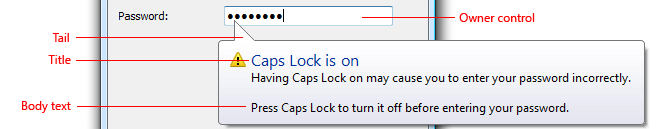
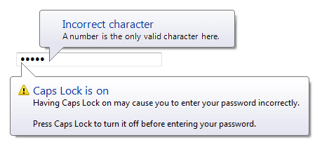
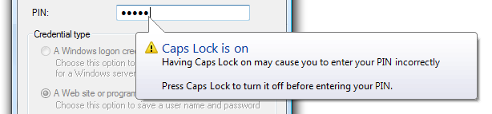

# Balloons
目录

* [Balloons](#balloons)
* [如何正确使用这个控件](#如何正确使用这个控件)
    * [与tooltips或者infotips的不同](#与tooltips或者infotips的不同)
    * [与modal dialog boxer的区别](#与modal-dialog-boxer的区别)
    * [与in-place messages的却别](#与in-place-messages的却别)
* [用法模版](#用法模版)
    * [Input problem](#input-problem)
    * [Special condition](#special-condition)
* [指南](#指南)
* [什么时候显示](#什么时候显示)
* [显示多长时间](#显示多长时间)
* [如何显示](#如何显示)
* [Password and PIN text boxes](#password-and-pin-text-boxes)
* [Other text boxes](#other-text-boxes)
* [Interaction](#interaction)
* [Icons](#icons)
* [Accessibility](#accessibility)
* [Text](#text)
    * [Title text](#title-text)
    * [Body text](#body-text)
* [Documentation](#documentation)

Balloons是一个小的浮动窗口，可以告诉用户一个不太关键的问题。
 
*以上是一个典型的Balloons。* 
Balloons拥有图标，标题和正文，以上三元素都是可选项。不同于tooltips和infotips，Balloons有一个尾巴指向触发它的来源。通常来源是一个控件（未完）
当Balloons通知用户一个并不关键的问题，它并不阻止问题，即使宿主控件打算如此。任何未解决的问题必须在宿主控件解决。
Balloons通常和text boxes一起使用，或者用了Text boxes的控件（用来更改值，比如combo boxes，list views和tree views）。（缺）

注意：notifications。tooltips等控件有单独的文章详述。
## 如何正确使用这个控件
考虑以下情况：
- 要传递的信息是否描述一个问题或者特定的情景。
    + 如果不是，请使用其他控件。不要使用Balloons去显示补充类的信息：考虑使用static text,infotips,pregressive disclosure和prompts.
- 该问题是否能够及时被捕获。
    + 宿主控件是否失去输入焦点。如果不是，请使用task dialog或者message box来显示错误消息。
- 对于该问题，是否很关键。
    + 如果很关键，请使用task dialog或者message box来显示错误消息。这种错误消息需要用户参与交互（对于关键错误很适合），而Balloons不需要。
- 该问题是否能清晰地表达。
    + 如果不能，请使用另一种控件。Balloons不能很详细地届时或者提供足够多的信息。
- 该问题hover over
- 该消息是否和当前用户的活动相关联。
    + 如果不是，请考虑使用notification或者dialog box代替。如果Balloons在当前用户活动之外，用户可能会忽视。默认地，Balloons一般只显示10分钟。
- 该消息是否来自于一个单一的来源。
    + 如果该问题来自于多种来源，使用inplace message或者dialog box代替。
    + 错误示例：  在这个例子当中，这种问题可能和当前用户的名字或者密码有关，但是报告该问题的方式通常暗示只有密码错了。
- 是是是
### 与tooltips或者infotips的不同
- Balloons能够独立地显示当前指向的地方
- Balloons拥有标题，正文和图标
- Balloons能够交互，然而并不能点
### 与modal dialog boxer的区别
- Balloons并不窃取输入焦点或者需要交互
- Balloons只显示单一的特定的来源。Modal dialogs有多个触发源
### 与in-place messages的却别
- Balloons能引起更多地注意
- Balloons并不需要屏幕控件或者动态层
- Balloons会在一段时间后自动地消失
## 用法模版
### Input problem
**来源于单一控件（如Text box），往往提示用户不太关键（严重）的问题。**
 

错误消息使用Balloons并不偷取用户的输入焦点，同时很明显。
为了解决这个问题，用户可能不得不得重新输入；但是如果用户忽略这个错误，用户可能根本不能做任何改变。因为这个问题并不关键，错误图标并不需要。
### Special condition

当特定的情景发生时，及时使用Balloons能阻止用户的沮丧情绪，如输入了一个超过系统限定的数字，或者输入的时候误碰了Caps Lock键。在这些情况下，给予此种回馈而不窃取用户输入焦点是很重要的。对于密码和PIN boxes，这些Balloons有一个警告的图标。
# 指南
## 什么时候显示
当特定问题呗发现时立即显示Balloons，即使重复显示，不要有任何明显的犹豫
- 对于超过最大输入值时，立即显示Balloons
- 对于需要非空值的输入，当失去焦点时显示Balloons
除此之外，一旦用户输入了非法值就显示Balloons会让用户非常讨厌
在同一时刻，只显示一个Balloons，显示多个Balloons容易使问题吞没。如果一个单一事件引起多个问题，要么展示所有问题，要么只显示最重要的问题。
 
## 显示多长时间
- 问题解决的时候
- 用户输入正常值（针对输入问题）
- Balloons显示时间完毕。一般，Balloons显示10秒钟

## 如何显示
- Balloons应低于宿主控件显示
    - 这么做是可以让用户浏览内容，包括控件上的标签。微软的Windows能自动布局Balloons。
    - 正确示例： 
     
    - 错误示例： 
     
## Password and PIN text boxes
- 使用Balloons展示Caps Lock键被激活，使用文字如下面的例子：
     
- 当用户试图输入超过最大临界值时显示Balloons
 
- 当用户输入并不正确的字符。然而，最好不要有这样的限制，因为对于密码来说，这会降低安全性。为了避免信息被泄露，在balloon里应该只提及正确密码规则。
 
## Other text boxes
当用户试图输入最大值时，考虑使用balloon，尤其针对新手用户。
 
## Interaction
Balloons不应有关闭按钮。
## Icons
请参考下面用户模式选择图标
- Input problem 
不需要用图标
- Special condition
使用标准的16*16 像素 warning icon.
## Accessibility
如果使用得合理，Balloons提高体验。
- 只显示当前用户活动
- Balloons的文字清晰明白。
- 当问题重现时，重新显示Balloons
## Text
### Title text
- 1
- 2
- 3
- 4
### Body text

## Documentation

